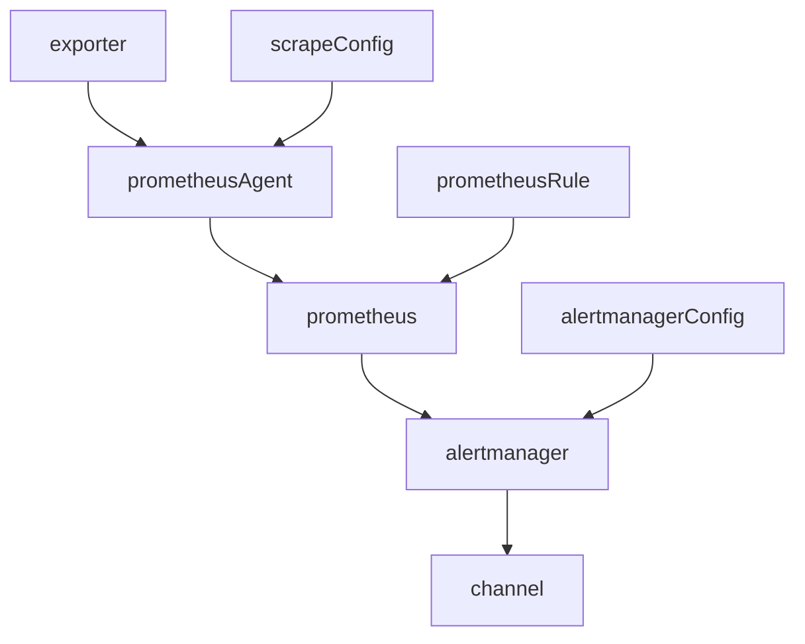

# mx-halldoor

## Who am I
从0开始，部署监控系统。prometheus不仅仅是用来监控k8s，还有很多好玩的东东。本部署基于prometheus operator，把这些好玩的东西带进来。

## Architecture Design

### prometheus
- only calc rules with PrometheusRule， without any scrape 
- receive metrics from PrometheusAgent
- send alert to Alertmanager

### prometheusAgent
- scrape metrics from exporter
- load config from ScrapeConfig with match label
- send metrics to prometheus，must enable remoteWrite

### alertmanager
- receive alerting from prometheus
- load config from alertmanagerConfig

### flowchart


## How to use

### Step 1
- create you own repo to store resource for k8s yaml
- create file prometheus.json, kubeconfig
- kubeconfig is your k8s kubeconfig, pls testing first
- prometheus.json is a file that describe how to setup a prometheus
- install prometheus-operator in your k8s cluster
```bash
LATEST=$(curl -s https://api.github.com/repos/prometheus-operator/prometheus-operator/releases/latest | jq -cr .tag_name)
curl -sL https://github.com/prometheus-operator/prometheus-operator/releases/download/${LATEST}/bundle.yaml | kubectl create -f -
```

### step 2
#### prometheus.json

| 字段名   | 字段类型  | 字段说明 | 必选项 |
|---------|----------|---------|--------|
| project | [projectObject](#projectObject) | 项目参数 | True |
| monitor | [monitorObject](#monitorObject) | 监控项配置 | True |
| component | [componentObject](#componentObject) | 监控核心组件配置 ｜ True |
| channel | [channelObject](#channelObject) | 告警渠道配置 ｜ True |

#### projectObject

| 字段名   | 字段类型  | 字段说明 | 必选项 |
|---------|----------|---------|--------|
| name | String      | 项目名，比如mammdoo|
| namespace | String | 项目所属namespace |
| state | String | 状态 创建资源present / 删除资源absent |

#### monitorObject

| 字段名   | 字段类型  | 字段说明 | 必选项 |
|---------|----------|---------|--------|
| github | [githubObject](#githubObject) | github repo监控配置 | False |

#### componentObject

| 字段名   | 字段类型  | 字段说明 | 必选项 |
|---------|----------|---------|--------|
| prometheus | [prometheusObject](#prometheusObject) | prometheus部署配置 | True |
| alertmanager | [alertmanagerObject](#alertmanagerObject) | alertmanager部署配置 | True |

#### channelObject

| 字段名   | 字段类型  | 字段说明 | 必选项 |
|---------|----------|---------|--------|
| titlePrefix | String | 告警消息标题前缀 | False |

#### githubObject

| 字段名   | 字段类型  | 字段说明 | 必选项 |
|---------|----------|---------|--------|
| env | []KeyValue | 环境变量 | False |
| quota | [quotaObject](#quotaObject) | 资源配额 | False |

#### quotaObject

| 字段名   | 字段类型  | 字段说明 | 必选项 |
|---------|----------|---------|--------|
| cpu | String | k8s cpu配额设置 | False |
| mem | String | k8s mem配额设置 | False |

#### prometheusObject

| 字段名   | 字段类型  | 字段说明 | 必选项 |
|---------|----------|---------|--------|
| storageClass | String | k8s sc名, minikube使用standard | True |
| capacity | String | k8s 申请存储容量，单位参考k8s | True |
| quota | [quotaObject](#quotaObject) | 资源配额 | False |

#### alertmanagerObject

| 字段名   | 字段类型  | 字段说明 | 必选项 |
|---------|----------|---------|--------|
| storageClass | String | k8s sc名, minikube使用standard | True |
| capacity | String | k8s 申请存储容量，单位参考k8s | True |
| quota | [quotaObject](#quotaObject) | 资源配额 | False |


### Step 3
```bash
### 仅生成相应的k8s资源文件
docker run --rm -it -v `your_repo_path`:/app/customer mammdoo/mx-halldoor:latest

### 部署至k8s
docker run --rm -it -v `your_repo_path`:/app/customer mammdoo/mx-halldoor:latest sh

ansible-playbook -i inventory/local prometheus.yml --tags=prometheus --extra="@customer/prometheus.json"
```